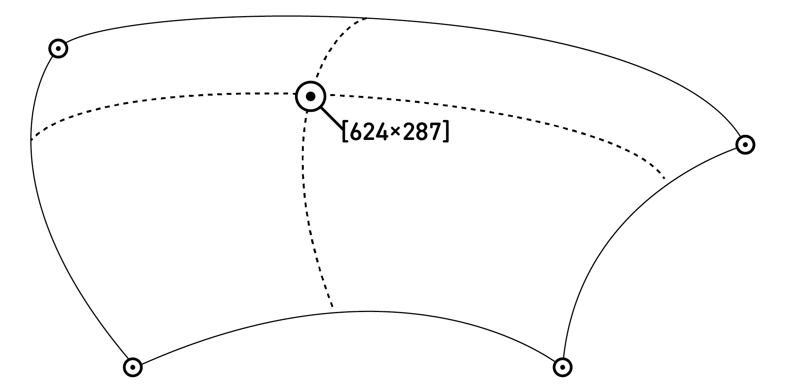

<h1 align="center">
 Coons Patch
</h1>

<p align="center">


[](https://github.com/dwyl/esta/issues)

</p>

A [Coons patch](https://en.wikipedia.org/wiki/Coons_patch) is a four-sided surface defined by four straight or curved edges. This package provides a small API for creating a coons-patch and locating points on that surface. It enhances the standard Coons-patch by accepting an additional two parameters, allowing for interpolation along each boundary rather than across just u and v axes.

Another package: [warp-grid](https://github.com/Undistraction/warp-grid) which supplies a greatly extended API build on-top of this package for modelling complex grids and might be more useful to you, depending on your use-case.

To visualise and play with a coons patch as used by warp-grid, use the [interactive editor](https://warp-grid-editor.undistraction.com/).

[Package Documentation](https://coons-patch-docs.undistraction.com) (Typedoc generated).

This package is written in TypeScript and exports its types.

## Install package

```bash
pnpm add coons-patch
# or
npm add coons-patch
# or
yarn add coons-patch
```

## Quick-start

```typeScript
import coonsPatch from 'coons-patch'

// Define bounding (cubic Bezier) curves for the patch
const boundingCurves = {
  top: {
    startPoint: { x: 0, y: 0 },
    endPoint: { x: 100, y: 0 },
    controlPoint1: { x: 10, y: -10 },
    controlPoint2: { x: 90, y: -10 },
  },
  bottom: {
    startPoint: { x: 0, y: 100 },
    endPoint: { x: 100, y: 100 },
    controlPoint1: { x: -10, y: 110 },
    controlPoint2: { x: 110, y: 110 },
  },
  left: {
    startPoint: { x: 0, y: 0 },
    endPoint: { x: 0, y: 100 },
    controlPoint1: { x: -10, y: -10 },
    controlPoint2: { x: -10, y: 110 },
  },
  right: {
    startPoint: { x: 100, y: 0 },
    endPoint: { x: 100, y: 100 },
    controlPoint1: { x: 110, y: -10 },
    controlPoint2: { x: 110, y: 110 },
  },
}

// Get the point using u and v ratios
const point = coonsPatch(boundingCurves, {u: 0.1, v: 0.6})
```

## A note on naming and the underlying math

Because a coons-patch is not bounded to x and y coordinates, the parameters `u` and `v` are used in algebraic descriptions to represent the two axes of the patch. Similarly `t` is used to for a single axes. The naming of the API reflects this to keep closer to the underlying math. In all cases, these parameters (`u`, `v` and `t`) are only valid in the range 0–1 inclusive, where 0 represents the beginning of a surface along that axis, and 1 represents the end. In this respect, the values can be thought of as ratios representing a position along a path from start to end.

## Usage

### Primitives

Points look like this, with coordinate values in pixels:

```typeScript
const point = {
  x: 34,
  y: 44
}
```

Curves are cubic Bezier curves:

```typeScript
const curve = {
  startPoint: {
    x: 0,
    y: 0
  },
  controlPoint1: {
    x: 0,
    y: 33
  },
  controlPoint2: {
    x: 0,
    y: 66
  },
  endPoint: {
    x: 0,
    y: 100
  }
}
```

### Bounding curves

To generate a patch you must provide a set of four **bounding curves** (`top`, `left`, `bottom` and `right`) in the form of four cubic Bezier curves. A cubic Bezier curve describes a straight-line or curve using a start point (`startPoint`), an end point (`endPoint`) and two other control points(`controlPoint1` and `controlPoint2`). Each point has an `x` and `y` coordinate.

At minimum you must supply start and end points for each curve. If you do not supply `controlPoint1` it will be set to the same coordinates as the start point, and if you do not supply `controlPoint2` it will be set to the same coordinates as the end point. Setting both control points to the same values as the start and end point will result in a straight line. You also need to ensure that the four curves meet at the corner.

You will probably be expecting the end of each curve to be the start of the next, however in keeping with the math involved in generating a coons-patch this is not the case. The `top` and `bottom` curves run left to right, and `left` and `right` curves run top to bottom, so this means that:

- the `startPoint` of the `top` curve must share the same coordinates with the `startPoint` of the `left` curve.
- the `endPoint` of the `top` curve must share the same coordinates with the `startPoint` of the `right` curve.
- the `startPoint` of the `bottom` curve must share the same coordinates with the end point of the `left` curve.
- the `endPoint` of the `bottom` curve must share the same coordinates with the `endPoint` of the `right` curve.

```
         top
     |-------->|
left |         | right
     V-------->V
       bottom
```

All arguments are carefully validated and you will receive a useful `ValidationError` if any of the arguments you supply are not valid.

Bounding curves look like this, where each item is curve.

```typeScript
const boundingCurves = {
  top: { … },
  bottom: { … },
  left: { … },
  right: { … }
}
```

### Interpolations

A large part of the work done by this package involves interpolation. To locate a point on the surface, it performs linear interpolation along the two axes, followed by bilinear interpolation to find the point on the surface. As mentioned above, four parameters are supported:

- `u` the value along the first horizontal axis.
- `v` the value along the first vertical axis.
- `uOpposite` the value along the opposite horizontal axis (defaults to the value of `u`)
- `vOpposite` the value along the opposite vertical axis. (defaults to the value of `v`)

This package supplies two different types of interpolation that you can configure, and you can provide your own interpolations if you like. These interpolation functions are exported alongside the API. Different interpolation functions for each axis are supported.

Both interpolations provided by this package use a factory pattern. You pass in any configuration and receive the interpolation function back, ready to pass in to `coons-patch` via its config.

#### `interpolatePointOnCurveEvenlySpacedFactory`

This is the default and provides the most evenly distributed interpolation at a cost of performance. It uses a look-up table (LUT) to addresses issues with linear interpolation that avoids distribution being affected by curvature of bounds. This function can additionally be configured using a `precision` value. This improves tha accuracy of the interpolation at the cost of performance and defaults to `20` which is a good ballance between accuracy and performance.

```typeScript
import coonsPatch, { interpolatePointOnCurveEvenlySpacedFactory } from 'coons-patch'

const interpolatePointOnCurve = interpolatePointOnCurveEvenlySpacedFactory({
  precision: 25,
})

coonsPatch(boundingCurves, {u: 0.25, v: 0.9}, {
  interpolatePointOnCurveU: interpolatePointOnCurve,
  interpolatePointOnCurveV: interpolatePointOnCurve
})
```

#### `interpolatePointOnCurveLinearFactory`

This is a much simpler type of interpolation, and results in distribution of points being affected by the curvature of the bounds. It is significantly more performant that the `interpolatePointOnCurveEvenlySpacedFactory`.

```typeScript
import coonsPatch, { interpolatePointOnCurveLinearFactory } from 'coons-patch'

// Note that this factory function doesn't currently accept any config.
const interpolatePointOnCurve = interpolatePointOnCurveLinearFactory()

coonsPatch(boundingCurves, {u:  0.25, v: 0.9}, {
  interpolatePointOnCurveU: interpolatePointOnCurve,
  interpolatePointOnCurveV: interpolatePointOnCurve
})
```

Write your own interpolation function with this signature:

```typeScript
(t: number, curve: Curve): Point
```

- `t` is the ratio along the axis (0–1 inclusive).
- `curve` is a cubic Bezier curve along which the interpolation will be used.

## Memoization

Note that wherever possible calculations are memoized to reduce the need to repeat identical calculations.

## Dependencies

This project has a single dependency: [fast-memoize](https://www.npmjs.com/package/fast-memoize) which is used for memoization of expensive calculations.

## Maintenance

### Install

```bash
pnpm install
```

### Build

```bash
pnpm run build # Build once
pnpm run build-watch # Build and watch for changes
```

### Preview build

```bash
pnpm run preview
```

### Generate docs

```bash
pnpm run docs
```

### View the generated docs

```bash
pnpm run docs-view
```

Docs are built and deployed to Vercel automatically when changes on `main` are pushed to origin.

### Run unit tests

Unit tests use vitest.

```bash
pnpm run test # Run tests once
pnpm run test-watch # Run tests and watch for changes
pnpm run test-coverage # Run tests and output a coverage report
pnpm run test-snapshot # Regenerate snapshots
```

### Lint

```bash
pnpm run lint-prettier
pnpm run lint-eslint
```

### Audit dependencies for security advisories

```bash
pnpm run audit-npm-packages
```

### Release

Releases are via semantic-release and executed on CI via Github actions.

The following steps are run as part of the actions pipeline

- Code is linted
- Unit tests are run
- TypeScript is compiled to JavaScript
- Package is released (if previous stages all pass)
